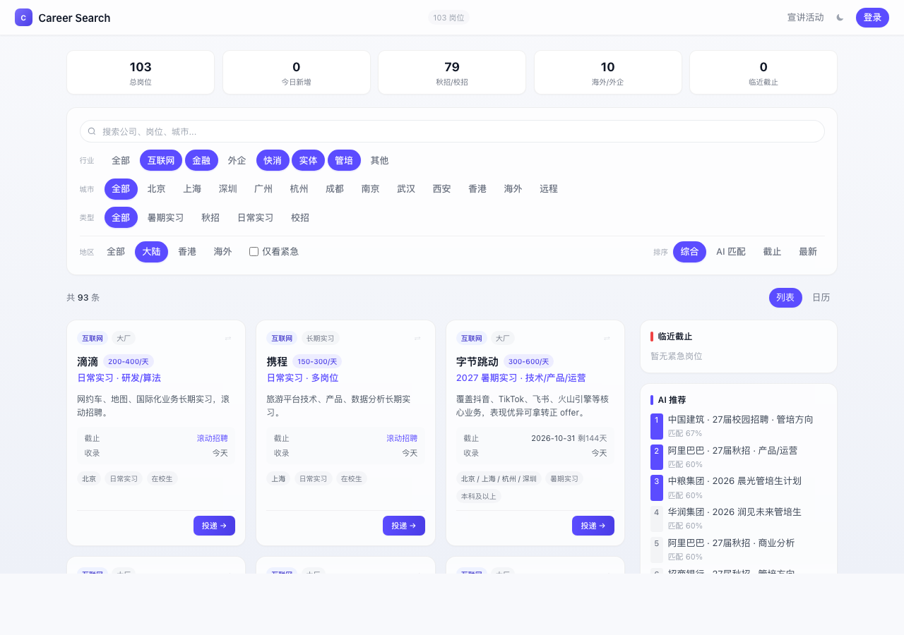

<div align="center">

# Career Search

> *「上传简历，AI 告诉你今天该投哪家。」*

[](https://career-search-ten.vercel.app/)
[](https://github.com/Jackychen-12/Career-Search/actions/workflows/deploy.yml)
[](https://nextjs.org/)
[](https://supabase.com/)
[](https://deepseek.com/)
[](https://vercel.com/)

<br>

**不是又一个岗位列表。是一个 AI 帮你打完整场秋招的工具。**

<br>

上传一份 PDF 简历，DeepSeek 解析出你的技能画像。1161 个岗位各自被 AI 打过标签——技能需求、岗位方向、行业属性。两者一匹配，你立刻知道该投谁、怎么投、怎么准备面试。

投递后不用开 Excel 跟踪——看板/时间线/表格三视图随你切。每天早上邮箱里躺着一封「今日匹配 8 个新岗位」。

**全站零成本运行。** Vercel + Supabase + Cloudflare Workers + GitHub Actions，每月 ¥0。

[立即体验](https://career-search-ten.vercel.app/) · [看功能](#能做什么) · [看架构](#技术架构) · [本地开发](#本地开发)

</div>

<p align="center">
  
</p>

---

## 能做什么

| 能力 | 交付物 | 亮点 |
|------|--------|------|
| **AI 简历解析** | 结构化画像（学校/技能/方向/优劣势） | 上传 PDF → DeepSeek 5 秒出结果 |
| **智能岗位匹配** | 每个岗位一个匹配分 + 匹配理由 | 离线 AI 标签 × 在线画像，不同人不同排序 |
| **岗位详情** | 完整 JD + AI 分析 + 一键面试题/求职信 | 1161 个详情页，技能高亮 |
| **AI 面试题** | 8-10 道定制题 + 参考答案 | 根据你的背景 × 具体 JD 生成 |
| **AI 简历润色** | 逐条优化 + 评分 + 关键词建议 | STAR 法则 + ATS 优化 |
| **AI 求职信** | 400-600 字定制求职信 | 一键复制，不是套话 |
| **AI Offer 对比** | 多维分析 + 推荐 + 谈薪建议 | 不再纠结选哪个 |
| **投递追踪** | 表格/时间线/看板三视图 | 8 种状态 · 导出 Excel |
| **投递清单** | 本周建议投递 Top 20 | 紧急度 × 匹配度排序，国内优先 |
| **岗位对比** | 2-3 个横向对比表 | 技能匹配高亮 + AI 推荐 |
| **求职报告** | 匹配分布/Top10/技能缺口/面试题/简历建议 | 可导出 PDF |
| **宣讲活动** | 搜狗微信爬取 + 公众号文章 | 搜索 + 筛选 |
| **每日邮件** | 个性化匹配岗位推送 | 只推跟你相关的 |
| **暗色模式** | 一键切换 | localStorage 记住 |

---

## 用户流程

```
登录（GitHub OAuth via Supabase）
  ↓
上传简历 PDF → DeepSeek 5 秒解析 → 自动填充画像
  ↓
首页 1161 岗位按你的画像实时排序
  ↓
点进岗位详情 → 一键生成面试题 / 求职信
  ↓
收藏 → 投递 → 笔试 → 面试 → HR面 → Offer
  ↓
每天早上邮箱收到新匹配岗位
```

---

## 技术架构

```
┌─────────────────────────────────────────────────────────────┐
│                       浏览器                                  │
│                                                             │
│   8 页面 · 客户端匹配引擎 · 暗色模式 · 骨架屏 · 动态导入    │
│   首页 JS 161KB · 27 单元测试覆盖核心逻辑                    │
└───────────────────────────┬─────────────────────────────────┘
                            │
        ┌───────────────────┼───────────────────┐
        ▼                   ▼                   ▼
┌──────────────┐   ┌──────────────┐   ┌────────────────┐
│   Vercel     │   │   Supabase   │   │  CF Workers    │
│              │   │              │   │                │
│  Next.js 14  │   │  Auth        │   │  5 AI 端点     │
│  SSG/SSR     │   │  PostgreSQL  │   │  简历解析      │
│  1161 详情页  │   │  RLS 安全    │   │  面试题       │
│              │   │  profiles    │   │  简历润色      │
│              │   │  tracking    │   │  求职信       │
│              │   │  job_stats   │   │  Offer 对比   │
└──────────────┘   └──────────────┘   └───────┬───────┘
                                              │
                                      ┌───────▼───────┐
                                      │ DeepSeek API  │
                                      └───────────────┘
        ▲
        │ 每天 06:23 自动
┌───────┴──────────────────────────────────────┐
│            GitHub Actions                     │
│                                              │
│  8 源爬虫 → AI 标签 → 邮件推送 → 自动部署     │
└──────────────────────────────────────────────┘
```

### 为什么这么选

| 选型 | 理由 |
|------|------|
| **Vercel** 而非 GitHub Pages | 支持 SSR + 动态路由 + 自动 CI/CD |
| **Supabase** 而非自建后端 | 零运维 + RLS 安全 + Auth 开箱即用 + 免费 |
| **DeepSeek** 而非 GPT | 中文能力强 + ¥1/百万 token（便宜 10 倍）|
| **CF Workers** 而非 Vercel API Routes | 全球边缘 + 0ms 冷启动 + 不占 Vercel 限额 |
| **动态导入 + 骨架屏** | 首页 JS 从 260KB → 161KB，体感秒开 |

---

## AI 匹配：两层设计

这是整个项目技术含量最高的部分：

**第一层（离线）**：GitHub Actions 每天调 DeepSeek，给 1161 个岗位打结构化标签——
```json
{ "skills": ["Python","数据分析"], "roleType": "产品", "industry": "互联网", "summary": "适合产品经理背景" }
```

**第二层（在线）**：用户设置画像后，浏览器端实时计算匹配——
```
技能命中 40% + 岗位方向 30% + 行业 15% + 城市 15% = 匹配度 85%
```

**效果**：同一个岗位，产品经理看到匹配 85%，后端工程师看到 30%。不同人打开同一个网站，看到的排序完全不同。

---

## 数据管道

8 个数据源，自动 7 个 + 手动 1 个兜底：

| 数据源 | 方式 | 频率 |
|--------|------|------|
| Seed（手工确认） | 固定 | 103 条真实国内岗位 |
| Greenhouse / Lever / Ashby | API | 每天自动 |
| 社区仓库（GitHub） | 爬取 | 每天自动 |
| 大厂官网 API（字节/腾讯/阿里/华为） | best-effort | 每天自动 |
| 牛客网讨论区 | 爬取 | 每天自动 |
| 搜狗微信（宣讲+文章） | 爬取 | 每天自动 |
| Boss 直聘 | 半自动（Puppeteer） | 手动按需 |

**数据真实性底线**：每条岗位都有官方投递链接。没确认的字段留空，不编造。

---

## 页面

| 路由 | 说明 |
|------|------|
| `/` | 首页（多选筛选 + 岗位卡片 + 侧边栏推荐） |
| `/job/[id]` | 岗位详情（AI 分析 + 面试题/求职信生成） |
| `/profile` | 画像设置（上传 PDF → AI 解析 → 匹配预览） |
| `/report` | 求职报告（匹配分布/技能缺口/投递策略） |
| `/skills` | AI 工具（面试题/简历润色/求职信/Offer 对比） |
| `/timeline` | 投递管理（表格/时间线/看板 三视图） |
| `/events` | 宣讲活动 + 公众号推送 |
| `/callback` | OAuth 回调 |

---

## 本地开发

```bash
git clone https://github.com/Jackychen-12/Career-Search.git
cd Career-Search
npm install
npm run crawl          # 抓取岗位 + AI 标签
npm run crawl:boss     # Boss 直聘手动爬（打开 Chrome）
npm run dev            # http://localhost:3000
npm test               # 27 个单元测试
```

---

## 数据规模

| 指标 | 数值 |
|------|------|
| 岗位总数 | 1,161 |
| AI 标签覆盖 | 100% |
| 岗位详情页 | 1,161 |
| 单元测试 | 27 |
| AI Skill 端点 | 5 |
| 数据源 | 8 |
| 首页 JS | 161KB |
| 月运行成本 | ¥0 |

---

## 作者

**Jacky Chen** · AI Product Manager who ships

[](https://github.com/Jackychen-12)

> 既定义 AI 产品，也亲手把它搭出来。

---

## License

MIT
